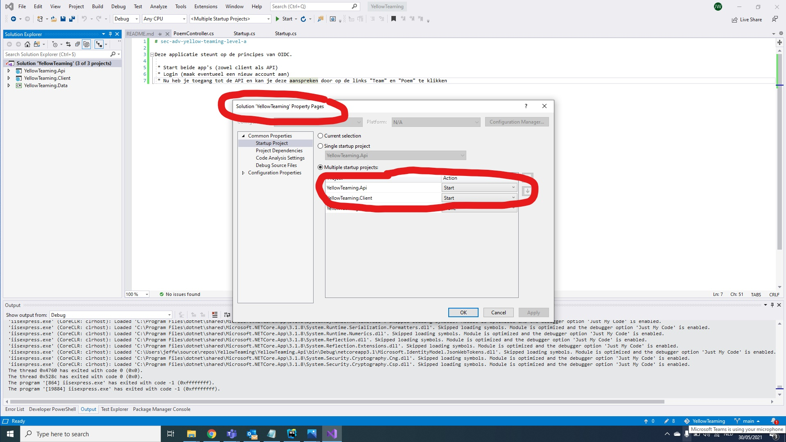

# sec-adv-yellow-teaming-level-a

Deze applicatie steunt op de principes van OIDC.

 * Start beide app's (zowel client als API)
 
 * Login (maak eventueel een nieuw account aan)
 * Nu heb je toegang tot de API en kan je deze aanspreken door op de links "Team" en "Poem" te klikken
